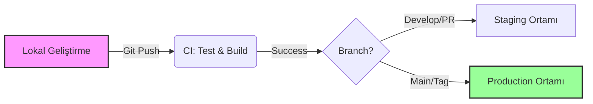

# 07 – Infrastructure as a Product: Altyapı, Hosting & CI/CD

> **Haftanın Mottosu:** "Amatörler kodu düzeltir, profesyoneller sistemi düzeltir. 'Benim makinemde çalışıyor' cümlesi, bir shipping şirketi kurup 'benim limanımda gemi yüzüyordu' demek gibidir."

Bu haftanın amacı; ürünü sadece kodlamak değil, onu canlı tutmak, güvenli bir şekilde güncellemektir.
Cloud dünyasında kaybolmak çok kolaydır. Amacımız AWS sertifikası almak değil, ürünü en az baş ağrısıyla yayına almaktır.

---

## 🎯 Haftanın Hedefleri (Learning Outcomes)

Bu modülü tamamladığında:
* [ ] VPS, PaaS ve Serverless arasındaki seçimi "trendlere" göre değil, "ihtiyaca" göre yapacaksın.
* [ ] **Vendor Lock-in** (Sağlayıcı Kilidi) riskini kod seviyesinde minimize etmeyi öğreneceksin.
* [ ] Tek kişilik dev kadro olsan bile **CI/CD pipeline** kurarak "FTP ile dosya atma" devrini kapatacaksın.
* [ ] Lokal ortamın ile Production ortamın arasındaki farkı (Environment Parity) sıfıra indireceksin.

---

# 1️⃣ Hosting Matrisi: Nerede Barınmalı?

Her seçeneğin bir "bedeli" vardır. Bu bedel ya paradır ya da zamandır.

| Model | Örnekler | Kimin İçin? | Avantaj (Pros) | Dezavantaj (Cons) |
| :--- | :--- | :--- | :--- | :--- |
| **VPS** | DigitalOcean Droplet, Hetzner, EC2 | **Kontrol Delisi & Bütçe Dostu** | Çok ucuz, tam kontrol, Docker ile taşınabilir. | Patch, güvenlik, yedekleme senin işin. (Ops Yükü Yüksek) |
| **PaaS** | Railway, Render, Fly.io, Heroku | **Hız Tutkunu (Solo Founder)** | "Git Push" ile deploy, sıfır sunucu ayarı, auto-SSL. | Daha pahalı, platform limitlerine takılabilirsin. |
| **Serverless** | AWS Lambda, Google Cloud Run | **Dalgalı Trafik & Event-Driven** | 0 trafiğe 0 fatura, sonsuz scale. | "Cold Start" sorunu, debug zorluğu, yüksek lock-in riski. |

> **Founder Tavsiyesi:** MVP için **PaaS (Railway/Render)** ile başla. Para kazanmaya başladığında ve fatura $100'ı geçtiğinde VPS veya Cloud Run'a geçersin.

---

# 2️⃣ Vendor Lock-in: "Taşınabilirlik" Sigortası

Lock-in, AWS kullanmak değil; AWS'nin **içine gömülmektir.**
Kodunu öyle yaz ki, sağlayıcıyı değiştirmek bir "rewrite" değil, bir "config değişikliği" olsun.

### 🛡 Nasıl Korunursun? (Abstraction Layers)

1.  **Storage:** Kodunda `AWS.S3.upload()` çağırma. `FileService.upload()` çağır. Arkada S3 uyumlu herhangi bir şey (Minio, R2, DO Spaces) kullanabilirsin.
2.  **Queue:** `SQS` veya `PubSub`'a göbekten bağlanma. Bir interface arkasında Redis veya RabbitMQ kullanılabilsin.
3.  **Database:** Managed Postgres kullanıyorsan, stored procedure'lere veya o cloud'a özel eklentilere aşırı yüklenme.

---

# 3️⃣ The Golden Pipeline: Local → Stage → Prod

Profesyonel bir akışta kodun yolculuğu şöyle olmalıdır:

### 0️⃣ Lokal Ortam (DevX)
* **Hedef:** `docker compose up` (veya benzeri tek komut) ile DB, Redis ve App ayağa kalkmalı.
* **Kural:** Prod'daki DB Postgres ise, lokalde SQLite kullanma. **Aynısını kullan.** Environment Parity (Ortam Eşitliği) bozulursa, "bende çalışıyordu" bahanesi başlar.

### 1️⃣ Staging (Prova Sahnesi)
* **Hedef:** Production'ın birebir kopyası (daha küçük kaynaklısı).
* **Amaç:** Environment variable hatalarını, migration sorunlarını ve build config farklarını burada yakalamak. Müşteri görmeden önce son kale.

### 2️⃣ Production (Sahne)
* **Hedef:** Stabilite ve Gözlemlenebilirlik.
* **Kural:** Asla "elle" (SSH ile girip) kod değiştirme. Sadece CI/CD deploy yapabilir. Read-only filesystem mantığıyla hareket et.

---

# 4️⃣ CI/CD: Solo Founder İçin "Minimum" Kurulum

DevOps mühendisi tutacak bütçen yoksa, GitHub Actions en iyi dostundur.

**Minimum Pipeline Adımları:**
1.  **Lint & Test:** Kod standartlara uyuyor mu? Testler geçiyor mu? (Geçmezse build alma).
2.  **Build:** Docker imajını oluştur ve Registry'ye (GHCR/DockerHub) at.
3.  **Deploy:** SSH ile sunucuya bağlanıp `docker pull && docker up` yap VEYA Webhook ile PaaS'ı tetikle.

> **Otomasyon Kuralı:** Eğer bir şeyi günde 2 kereden fazla elle yapıyorsan, script yaz.

---

# 5️⃣ Deployment Tarifleri (Recipes)

Hangi malzemelere sahip olduğuna göre menüyü seç:

### 🍔 Menü A: "Gariban Dostu" (VPS + Docker)
* **Stack:** Hetzner/DigitalOcean VPS ($5-10/ay).
* **Araç:** Coolify (Kendi PaaS'ın) veya düz Docker Compose.
* **Avantaj:** En ucuz maliyet.
* **Dezavantaj:** Sunucu güncellemesi, güvenliği senin sorumluluğunda.

### 🍱 Menü B: "Zengin ve Hızlı" (PaaS)
* **Stack:** Vercel (Frontend) + Railway/Render (Backend & DB).
* **Araç:** GitHub entegrasyonu (Otomatik deploy).
* **Avantaj:** Sıfır ops, maksimum hız. Gece rahat uyursun.
* **Dezavantaj:** Trafik artarsa cüzdanı yakar.

### 🥗 Menü C: "Hybrid & Scalable" (Cloud Native)
* **Stack:** Frontend (Vercel/Netlify) + Backend (Cloud Run/Lambda) + Data (Managed DB).
* **Avantaj:** Scale sorunu yok.
* **Dezavantaj:** Cold start, karmaşık IAM rolleri, log takibi zorluğu.

---

# 🧪 Case Study: SilentCut.io Altyapısı

SilentCut.io'ın ihtiyaçları:
* Yüksek Disk Alanı (Video dosyaları).
* Anlık Yüksek CPU (Video işleme).

**Seçilen Model:** **Menü C (Hybrid)**
1.  **Web:** Vercel (Next.js).
2.  **API & Worker:** Google Cloud Run (Sadece video işlenirken para yazar).
3.  **Storage:** Cloudflare R2 (S3 uyumlu ama egress ücreti yok - video indirme maliyeti için kritik).
4.  **Queue:** Redis (Upstash - serverless).

*Neden? Çünkü video işleme işi "burst" (patlamalı) bir iştir. Sunucu kiralarsak %90 boş yatacak. Serverless burada maliyeti %80 düşürdü.*

---

# ⚡️ Haftalık Görevler (Commitment Checklist)

### 1. [ ] Hosting Modelini Seç
VPS mi, PaaS mı? Karar ver ve nedenini yaz.
> *"Ben [MODEL]'i seçtim çünkü şu an [HIZ/MALİYET] benim için daha önemli."*

### 2. [ ] "Hello World" Deploy
Basit bir `index.html` veya `/health` endpoint'ini seçtiğin platformda canlıya al. SSL (https) kilidini gör.

### 3. [ ] GitHub Actions (CI) Kurulumu
Basit bir `.github/workflows/deploy.yml` dosyası oluştur. En azından "Push yapıldığında testleri çalıştır" adımı olsun.

### 4. [ ] Lock-in Check
Projenin konfigürasyon dosyasına bak. AWS/GCP'ye özel hard-coded ID'ler veya region'lar kodun içinde mi, yoksa `.env` dosyasında mı?

---

# ⛔️ Yasaklı İşlemler (Anti-Patterns)

* **"FTP ile dosya atmak."** -> Yıl 202X. Yapma.
* **"Production veritabanına lokalden bağlanmak."** -> Bir gün yanlışlıkla `DROP TABLE` yazacaksın. Yapma.
* **"Kubernetes (K8s) kurmak."** -> Google ölçeğinde değilsen, MVP için K8s, nükleer santralle yumurta pişirmektir.

---

## 🔜 Gelecek Hafta: Monitoring & Operasyon

Kod canlıda ama sağlıklı mı?
* Kullanıcılar hata alıyor mu? (Sentry).
* Sunucu yavaşladı mı? (APM).
* Gece 3'te site çökerse seni kim uyandıracak? (Alerting).

---
*Developer to Founder - Week 07*
