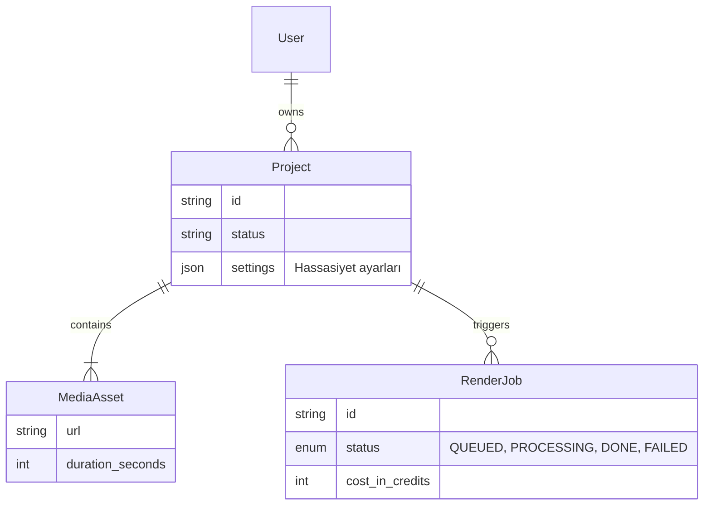

# 11 – Database Design for Founders: Veri Modeli ve İş Mantığı

> **Haftanın Mottosu:** "Kod geçicidir, Veri kalıcıdır. Arayüzü (UI) her hafta değiştirebilirsin ama veritabanı şemasını değiştirmek açık kalp ameliyatı gibidir."

Bu haftanın amacı akademik bir "Domain Driven Design (DDD)" dersi vermek değil.
Amacımız; MVP heyecanıyla yapılan **"Ekran Odaklı Veritabanı Tasarımı"** hatasını engellemektir. Çünkü yanlış veri modeli, projenin büyümesini durduran görünmez bir duvardır.

---

## 🎯 Haftanın Hedefleri (Learning Outcomes)

Bu modülü tamamladığında:
* [ ] **UI-Driven** (Ekrana göre) değil, **Domain-Driven** (İşe göre) veritabanı tasarlamayı öğreneceksin.
* [ ] "Business Logic"i (İş Kuralları) frontend'den alıp, backend'in kalbine (Service Layer) koyacaksın.
* [ ] **JSON Sütunu Tuzağı**'na düşmeyip, ilişkisel verinin gücünü kullanacaksın.
* [ ] `User`, `Account`, `Team` gibi kavramları baştan doğru kurgulayarak gelecekteki "B2B Pivot" ihtimaline açık kapı bırakacaksın.

---

# 1️⃣ Büyük Hata: UI Odaklı Tasarım

Genç girişimciler/geliştiriciler veritabanını şöyle tasarlar:
> *"Profil sayfasında kullanıcının 'Son İzledikleri' var. O zaman Users tablosuna `last_watched_videos` diye bir string array açayım."*

**Neden Yanlış?**
1.  **Sorgulanamaz:** "X videosunu izleyen kullanıcıları bul" dersen sistem çöker.
2.  **Tutarsızlık:** Video silinirse, kullanıcının listesinde "null" veya bozuk ID kalır.
3.  **Kilitlenme:** Yarın "İzleme Tarihi"ni de tutmak istersen o array çöp olur.

> **Doğru Olan:** Veritabanı, ekranın aynası değildir. Veritabanı, gerçeğin (Truth) aynasıdır.

---

# 2️⃣ Logic Nerede Durmalı? (Frontend vs Backend)

Bir kural: *"Kullanıcı kredisi bitmişse 'Yükle' butonu pasif olsun."*

### ❌ Yanlış (Frontend Logic)
React içinde:
```javascript
if (user.credits <= 0) { <Button disabled /> }
```
Risk:_ Hacker, Chrome DevTools'dan butonu `enabled` yapar ve API'ye isteği atar.

### ✅ Doğru (Domain Logic)

Backend Service içinde:
```go
func (s *VideoService) Upload(user User, file File) {
    if !user.CanUpload() {
        return Error("Yetersiz Kredi")
    }
    // ...
}
```
_Güven:_ Frontend sadece durumu gösterir (`display`), kararı vermez (`decide`).

----------

# 3️⃣ MVP Veri Modeli Kontrol Listesi
Hızlı gitmek istiyorsun, anlıyorum. Ama şu 4 maddeyi baştan doğru kurarsan, ileride kendine teşekkür edersin:

### A) ID Stratejisi
-   `Integer (1, 2, 3)` kullanma. Rakiplerin "user/5" endpointini deneyerek kaç müşterin olduğunu bulur.
-   **UUID** veya **CUID/NanoID** kullan.

### B) User vs. Account (Tenant) Ayrımı
-   Sadece `User` tablosu yaparsan, yarın bir şirket "5 kişilik ekip kurmak istiyorum" dediğinde tüm sistemi baştan yazarsın.
-   **Öneri:** Her zaman `User` (Kişi) ve `Organization/Team` (Hesap) tablolarını ayır. Solo kullanıcı olsa bile kendi Organization'ı olsun.

### C) Para ve Zaman
-   Parayı asla `float` (kuruş hatası olur) tutma. `Integer` (Cent/Kuruş cinsinden) veya `Decimal` tut.
-   Zamanı her zaman `UTC` tut. Kullanıcıya gösterirken tarayıcı saatine çevirirsin.

### D) Soft Delete
-   Veriyi `DELETE FROM` ile silme. `deleted_at` sütunu ekle.
-   Müşteri "Yanlışlıkla sildim" diye ağlayarak geldiğinde kurtarıcısı olursun.

----------

# 4️⃣ JSON Sütunu: Dost mu Düşman mı?
Postgres'in `JSONB` özelliği harikadır ama tembel geliştiricinin tuzağıdır.

**Ne Zaman Kullanmalı?**
-   Dış servisten gelen response'u loglarken (Webhook payload).
-   Ürünün doğası gereği şeması olmayan özelliklerde (E-ticaret ürün özellikleri: Renk, Beden, Ağırlık).

**Ne Zaman Kullanmamalı?**
-   Sorgu atacağın verilerde.
-   İlişkisel verilerde (Foreign Key gereken yerlerde).

> **Kural:** Eğer o veriye `WHERE` şartı yazacaksan, o ayrı bir sütun olmalıdır.

----------

# 5️⃣ Case Study: SilentCut.io Domain Tasarımı
Hadi SilentCut.io'ın veritabanını tasarlayalım.

**Yanlış Model (Excel Kafası):**
-   `Table: Videos` -> {id, user_id, status, file_url, detected_silences_json}

**Doğru Model (Domain Kafası):**


**Neden Böyle?**
-   `Settings` (Ayarlar) JSON olabilir çünkü sorgulanmayacak.
-   `Job` (İşlem) ayrı bir tablo çünkü bir videoyu 3 kere farklı ayarlarla işleyebilir. Geçmişi tutmak istiyoruz.
-   `Status` bir Enum olmalı, string değil.

----------

# 🛠️ Haftalık Görevler (Commitment Checklist)
### 1. [ ] Şema Taslağını Çiz
dbdiagram.io veya kağıt üzerinde. Tablolarını ve okları çiz.
-   _Soru:_ Bir kullanıcı silinirse, videoları ne olacak? (Cascade Delete mi, Set Null mı?)

### 2. [ ] "Single Source of Truth" Kontrolü
Veritabanında aynı veriyi iki yerde tutuyor musun? (Örn: Hem `fiyat` tablosunda hem `sipariş` tablosunda ürün fiyatı var mı? _Not: Siparişte olması doğrudur, fiyat değişebilir._)

### 3. [ ] İş Kurallarını Yaz (Pseudo-Code)
Kod yazmadan, mantığı yaz.
-   _"Video işleme bittiğinde -> Kullanıcıya mail at -> Kredisini düş -> Job statüsünü güncelle."_
-   Bu akış Transactional olmalı mı? (Evet).

----------

# ⛔️ Yasaklı Alışkanlıklar (Anti-Patterns)
-   **"God Object":** `User` tablosuna 50 tane sütun eklemek. (Böl bunu: `UserProfile`, `UserSettings`, `UserBilling`).
-   **"Frontend Driven Schema":** Frontend geliştiricisi "Bana veri şöyle gelsin" dedi diye veritabanını yamultmak. (Arada API katmanı/DTO kullan, DB'yi bozma).
-   **"Sonra Migration Yaparız":** Tablo doluyken migration yapmak, uçak havadayken motor değiştirmektir. Temeli sağlam at.

----------

## 🔜 Gelecek Hafta: Kullanıcı Akışları & UX Tutarlılığı
Veri modelimiz taş gibi sağlam. Şimdi bu veriyi kullanıcıya nasıl göstereceğimizi, **Frontend Mimarisi** ve **Kullanıcı Akışlarını (User Flows)** konuşacağız.
-   Ekran değil, Akış tasarlamak.
-   Loading / Error / Empty state'leri neden en başta yapılmalı?

----------
_Developer to Founder - Week 11_
