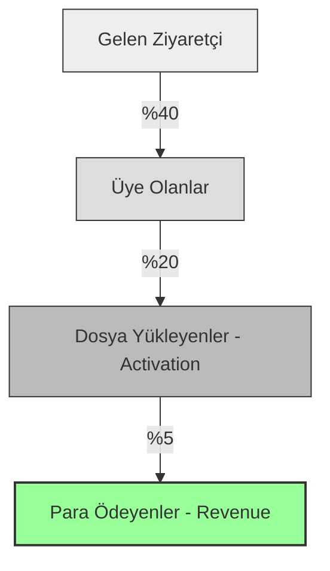

# 16 – Measure What Matters: Analitik & Doğru Metrikler

> **Haftanın Mottosu:** "Ölçmediğin şeyi yönetemezsin. Ama yanlış şeyi ölçersen, uçuruma doğru yönetirsin."

Bu haftanın amacı, Google Analytics grafiğine bakıp "Ooo trafik artmış" diyerek kendini kandırmak değil; kullanıcının **nerede takıldığını** ve **neden para ödemediğini** bulmaktır.

Bir geliştirici için loglar "Sistem Hatalarını" gösterir. Analitik ise "Ürün Hatalarını" gösterir.

---

## 🎯 Haftanın Hedefleri (Learning Outcomes)

Bu modülü tamamladığında:
* [ ] **Vanity Metric** (Ego Metriği) ile **Actionable Metric** (Karar Metriği) arasındaki farkı ayırt edebileceksin.
* [ ] **"The Funnel"** (Huni) mantığını anlayıp, sızıntı yapan yerleri tespit edeceksin.
* [ ] **AARRR** (Pirate Metrics) çerçevesini MVP'ne uygulayacaksın.
* [ ] Sayfa görüntüleme (Pageview) yerine **Olay (Event)** takibi yapmayı öğreneceksin.

---

# 1️⃣ Vanity vs. Actionable: Kendini Kandırma

Yatırımcı sunumlarında Vanity Metric kullanılır. Ama ürünü geliştirirken Actionable Metric kullanılır.

| Metrik Tipi | Örnek (Vanity) | Örnek (Actionable) | Neden Farklı? |
| :--- | :--- | :--- | :--- |
| **Kullanıcı** | "Toplam 10.000 Kayıtlı Kullanıcı" | "Günlük 50 Aktif Kullanıcı (DAU)" | 10k kişi kaydolup gitmiş olabilir. Önemli olan kaçı şu an burada. |
| **Trafik** | "Ayda 1 Milyon Sayfa Görüntüleme" | "Ziyaretçi Başına Dönüşüm Oranı %2" | Herkes gelip bakıp çıkıyorsa, trafik çöp demektir. |
| **Sosyal** | "Twitter'da 50k Takipçi" | "Twitter'dan gelenlerin %10'u üye oluyor" | Takipçi karın doyurmaz, dönüşüm doyurur. |

> **Kural:** Bir metriğe baktığında **"Eee, şimdi ne yapayım?"** sorusuna cevap veremiyorsan, o bir Vanity Metric'tir.

---

# 2️⃣ The Funnel (Huni): Kullanıcı Nerede Dökülüyor?

Kullanıcıların hepsi müşteriye dönüşmez. Bir huniden geçerler ve her adımda bir kısmı kaybolur.

**Senin Görevin:**
-   Ziyaretçiyi artırmak değil (O pazarlamanın işi).
-   **B -> C** ve **C -> D** arasındaki kaçışları azaltmaktır (Bu ürünün işi).
-   _Örnek: Üye olanların sadece %20'si dosya yüklüyorsa, "Upload" butonu mu görünmüyor? Yoksa sistem mi karışık?_

----------

# 3️⃣ AARRR Çerçevesi (Pirate Metrics)

Dave McClure'un meşhur modeli. MVP için en sade hali:

1.  **Acquisition (Edinim):** İnsanlar seni nasıl buluyor? (Google, Twitter, Reklam).
2.  **Activation (Aktivasyon):** **EN ÖNEMLİSİ.** Kullanıcı "Aha!" anını yaşadı mı?
    -   _SilentCut.io.io için:_ İlk videonun başarıyla indirilmesi.
3.  **Retention (Elde Tutma):** Kullanıcı geri geliyor mu? (Yoksa tek atımlık mı?).
4.  **Revenue (Gelir):** Para veriyor mu?
5.  **Referral (Tavsiye):** Arkadaşına öneriyor mu?

> **Founder Tavsiyesi:** MVP aşamasında sadece **Activation** ve **Retention**'a odaklan. Sepeti delik kovaya su doldurma (Acquisition yapma).

----------

# 4️⃣ Event Tracking: "Sayfa" Değil "Olay"

Google Analytics varsayılan olarak "Hangi sayfaya girdi?" sorusunu cevaplar. Ama modern web uygulamaları (SPA) tek sayfadır.

Senin şunları ölçmen lazım (Custom Events):

-   `button_clicked { name: "upload_video" }`
-   `process_failed { reason: "timeout" }`
-   `payment_success { plan: "pro_monthly" }`  

**Araç Önerisi:**
-   **Google Analytics 4 (GA4):** Standart ama kurulumu ve raporlaması zordur.
-   **PostHog / Mixpanel:** Ürün analitiği için çok daha iyidir. "Funnel" çizmek tek tıkla yapılır. Solo founderlar için ücretsiz planları yeterlidir.

----------

# 5️⃣ Case Study: SilentCut.io Metrikleri

SilentCut.io için "Başarı" nedir?

-   **Vanity:** "Siteye kaç kişi girdi?" (Umrumuzda değil).
-   **North Star Metric (Kuzey Yıldızı):** **"Haftalık İşlenen Video Dakikası".**
    -   Eğer bu sayı artıyorsa, insanlar ürünü kullanıyor ve fayda sağlıyor demektir.
    -   Eğer kullanıcı artıyor ama dakika artmıyorsa, insanlar üye olup çıkıyor demektir.  

**Ölçülen Kritik Eventler:**

1.  `upload_start`: Niyet var mı?
2.  `upload_complete`: Teknik sorun var mı?
3.  `export_download`: Mutlu son.

----------

# 🛠️ Haftalık Görevler (Commitment Checklist)

### 1. [ ] Funnel'ını Çiz

Kağıda 4 kutu çiz: `Ziyaret` -> `Kayıt` -> `İlk İşlem` -> `Ödeme`. Şu anki tahmini oranlarını yaz.

### 2. [ ] "Kuzey Yıldızı"nı Belirle

Senin ürününün gerçekten değer ürettiğini gösteren TEK metrik ne?
-   _Airbnb için: Rezerve edilen gece sayısı._
-   _Senin için: ...?_

### 3. [ ] Event Listesi Oluştur

Kodun içine gömeceğin 5 kritik olayı yaz.
-   Örn: `signup`, `activation_action`, `payment`.

### 4. [ ] Bir Analitik Aracı Kur
PostHog (önerilir) veya GA4. Sadece kodu ekle ve "Sign Up" butonuna tıklayınca event düştüğünü gör.

----------

# ⛔️ Yasaklı Davranışlar (Anti-Patterns)
-   **"Dashboard Bağımlılığı":** Günde 50 kere F5 yapıp sayılara bakmak. (Haftada 1 detaylı bak yeter).
-   **"Analiz Felci (Analysis Paralysis):** Veri yetersiz diye karar almamak. Bazen sezgi veriden hızlıdır.
-   **"Her Şeyi Ölçmek":** Mouse hareketlerini bile loglamak. Çöplük yaratır. Sadece karar aldıracak veriyi ölç.

----------

## 🔜 Gelecek Hafta: Lansman & Go-to-Market

Ölçmeyi öğrendik. Artık ölçülecek insanları içeri alma vakti.

-   **17. Hafta:** Lansman Stratejisi.
-   Product Hunt, Twitter/X, Reddit... Nereden başlamalı?
-   "Soft Launch" ile "Hard Launch" farkı.

----------

_Developer to Founder - Week 16_
